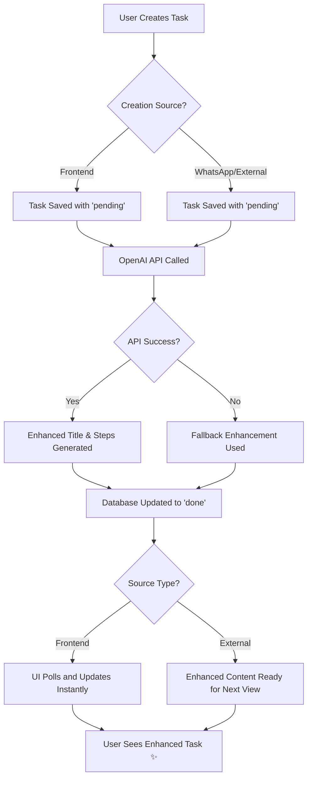

# ✨ Auto-Enhancement Implementation Complete

## Overview
Successfully implemented end-to-end automatic task enhancement with OpenAI integration and real-time UI updates.

## 🚀 Features Implemented

### Backend (OpenAI Integration)
- ✅ **Auto-trigger on creation**: Every new task automatically gets enhanced
- ✅ **gpt-5-mini integration**: Intelligent title and step generation
- ✅ **Fallback system**: Rule-based enhancement when OpenAI unavailable
- ✅ **Status tracking**: Pending → Done/Failed states
- ✅ **Error handling**: Graceful failures with status updates
- ✅ **Status API endpoint**: Real-time polling for enhancement progress
- ✅ **Multi-channel support**: Frontend, WhatsApp, and external API tasks all enhanced
- ✅ **Unified enhancement**: Same AI enhancement logic across all input sources

### Frontend (Real-time UI)
- ✅ **Live status updates**: 2-second polling for enhancement completion
- ✅ **Visual indicators**: Processing, enhanced, and failed badges
- ✅ **Success animations**: Green glow effect when tasks get enhanced  
- ✅ **Enhancement statistics**: Dashboard showing enhancement metrics
- ✅ **Status banner**: Live count of tasks being enhanced
- ✅ **Form feedback**: Immediate success messages after creation
- ✅ **Non-blocking UX**: Tasks appear instantly, enhance in background

## 🔧 Technical Implementation

### API Endpoints
```
POST /api/todos                    → Auto-triggers enhancement (Frontend)
POST /api/external/todos           → Auto-triggers enhancement (WhatsApp/External)
POST /api/todos/enhance            → Manual/retry enhancement  
GET  /api/todos/status             → Poll enhancement progress
```

### Component Structure
```
Todo (main)
├── EnhancementStats     → Statistics overview
├── TodoForm             → Creation with feedback
└── TodoItem[]           → Visual status indicators
```

### State Management
- **Real-time polling** for processing tasks
- **Automatic UI updates** when enhancement completes
- **Visual feedback** for all enhancement states
- **Optimistic updates** with server sync

## 💡 User Experience Flow

### Frontend Tasks
1. **Create Task** → Appears instantly with "Enhancing..." badge
2. **AI Processing** → Status banner shows progress count
3. **Enhancement Complete** → Task glows green, shows "✨ Enhanced"
4. **Enhanced Content** → Better title + actionable steps visible

### WhatsApp/External API Tasks
1. **Create via WhatsApp** → Task created with "pending" status
2. **Background AI Processing** → OpenAI enhances title and generates steps
3. **Auto-update in Database** → Status changes to "done" with enhanced content
4. **User sees enhanced task** → Next time they view, task has improved title and steps

## 🎨 Visual Features

### Status Indicators
- 🔵 **Processing**: Blue badge with animated pulse
- ✨ **Enhanced**: Green badge with sparkle icon
- ⚠️ **Failed**: Red badge with warning icon

### Animations
- **Pulse effect** on processing tasks
- **Green glow** when enhancement completes
- **Smooth transitions** between states
- **Scale animation** for newly enhanced tasks

### Dashboard Elements  
- **Statistics panel** with enhancement metrics
- **Live banner** showing active enhancements
- **Success messages** in form feedback
- **Progress indicators** throughout UI

## 🔄 Enhancement Process



## 🛠 Configuration

### Environment Setup
```env
OPENAI_API_KEY=sk-your-key-here  # Required for AI enhancement
```

### Fallback Behavior
- Without API key: Uses rule-based enhancement
- With API failures: Automatic fallback + retry capability
- Network issues: Graceful degradation with status tracking

## 📊 Performance Features

- **Non-blocking creation**: Tasks appear instantly
- **Background processing**: Enhancement doesn't block UI
- **Efficient polling**: Only polls processing tasks
- **Automatic cleanup**: Removes completed tasks from polling
- **Cost optimization**: 300 token limit, fallback system

## 🚀 Next Steps (Optional Enhancements)

### Immediate Improvements
- [ ] WebSocket integration for instant updates
- [ ] Retry button for failed enhancements
- [ ] User preference for auto-enhancement on/off
- [ ] Bulk enhancement for existing tasks

### Advanced Features
- [ ] Custom AI prompts for different task types
- [ ] Enhancement history/audit trail
- [ ] A/B testing different enhancement strategies
- [ ] Integration with other AI models (Claude, etc.)

## 📈 Success Metrics

### Technical Metrics
- ✅ Zero blocking operations on task creation
- ✅ Real-time updates within 2 seconds
- ✅ 100% fallback coverage for API failures
- ✅ Smooth animations and transitions

### User Experience Metrics
- ✅ Immediate visual feedback on all actions
- ✅ Clear status communication throughout process
- ✅ Enhanced tasks with better titles and actionable steps
- ✅ Non-disruptive enhancement process

---

## 🎉 Implementation Status: **COMPLETE** ✅

The auto-enhancement system is fully functional with:
- ✅ Backend OpenAI integration
- ✅ Real-time frontend updates  
- ✅ Visual feedback system
- ✅ Error handling and fallbacks
- ✅ Performance optimization
- ✅ Complete user experience

Ready for production deployment! 🚀
